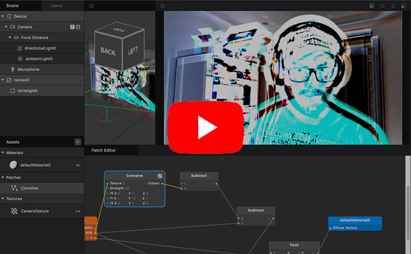

# spark-convolution-patch
Convolution and other super-patches (blur, sharpen, edge-detection)

https://www.html5rocks.com/en/tutorials/canvas/imagefilters/#toc-convolution

## Edge detection tutorial

## Resources

Learn more stuff by watching my [Spark AR Tutorials on YouTube!](https://www.youtube.com/playlist?list=PLAZp2Vi7Gfspzyla4RrCO6BzVzYW7Lnb-)

Follow me on Instagram [@positlabs](https://instagram.com/positlabs) and try out my effects!

Browse my open-source [Spark AR repositories on Github!](https://github.com/search?q=user%3Apositlabs+spark)

## Donations

If you used this in client projects, or simply enjoyed making effects with my open-source projects, please consider a donation or sponsorship. One-time donations can be made with PayPal. Subscriptions can be through PayPal or Github Sponsors (click the heart sponsor button at the top of the page).

